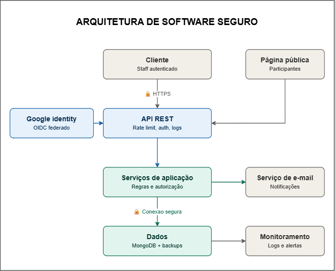

# 20. Diagrama da arquitetura segura

O diagrama a seguir apresenta a arquitetura segura proposta para a plataforma BAITA Eventos. Ele relaciona os usuários, a página pública, a API REST, a autenticação federada com Google/OIDC, as regras de autorização, o MongoDB, o serviço de e-mail, os registros de logs, o monitoramento e os controles de disponibilidade e recuperação.

*Figura 1 — Diagrama da arquitetura segura da plataforma BAITA Eventos.*

# 21. Decisões de arquitetura

## 21.3 Decisão 3 — Implementar controles de disponibilidade e recuperação

| Elemento | Descrição |
|---|---|
| Problema ou risco tratado | R09 — Indisponibilidade da plataforma |
| Decisão tomada | Implementar limitação de requisições na API REST, monitoramento de disponibilidade e consumo de recursos, registros de eventos, cópias de segurança do MongoDB e procedimentos testados de restauração. Mecanismos de redundância deverão ser adotados quando forem viáveis para os componentes e serviços essenciais. |
| Motivo | A API REST e o MongoDB sustentam inscrições, check-ins, avaliações e operações administrativas. Uma sobrecarga, falha técnica ou indisponibilidade desses componentes pode interromper várias funcionalidades ao mesmo tempo. |
| Componentes afetados | API REST, MongoDB, serviço de logs e monitoramento, infraestrutura de cópias de segurança e serviços externos relevantes. |
| Resultado esperado | Redução da probabilidade de indisponibilidade, identificação mais rápida de falhas, preservação dos dados e capacidade de restaurar os serviços essenciais após um incidente. |

# 22. Rastreabilidade da arquitetura segura

A proposta da Etapa 3 mantém a rastreabilidade com as etapas anteriores. Os riscos prioritários da Etapa 2 foram utilizados como origem dos requisitos de segurança, das decisões de arquitetura e dos controles posicionados no diagrama da arquitetura segura.

| Risco prioritário | Requisito de segurança | Decisão de arquitetura | Controles principais |
|---|---|---|---|
| R09 — Indisponibilidade da plataforma | RS01 — Disponibilidade da plataforma | Decisão 3 — Implementar controles de disponibilidade e recuperação | Limitação de requisições, monitoramento, logs, cópias de segurança, restauração e redundância quando viável. |
| R01 — Comprometimento de contas autentic
