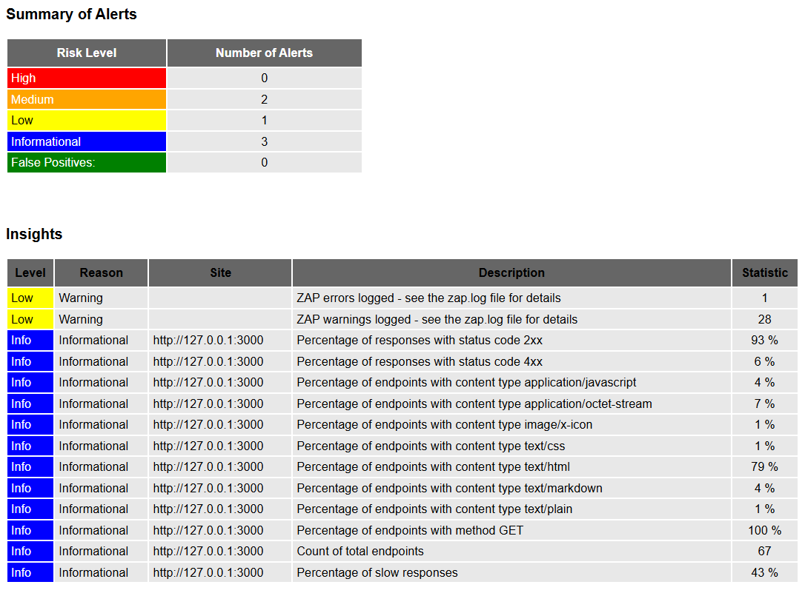
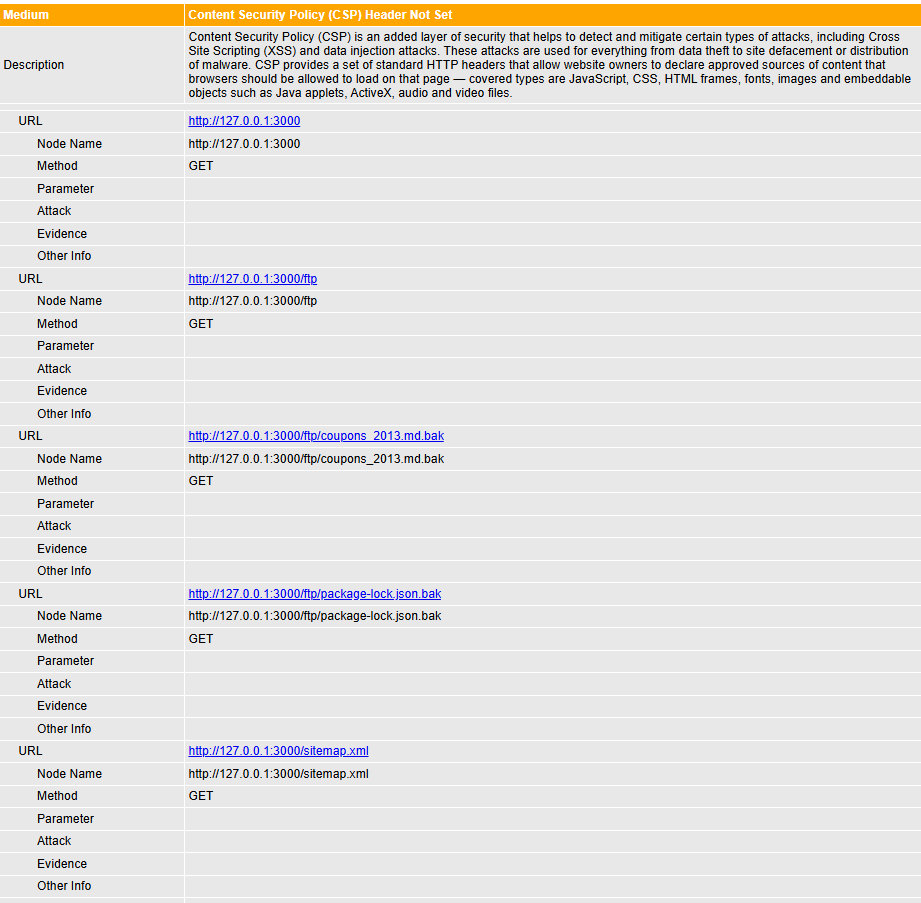
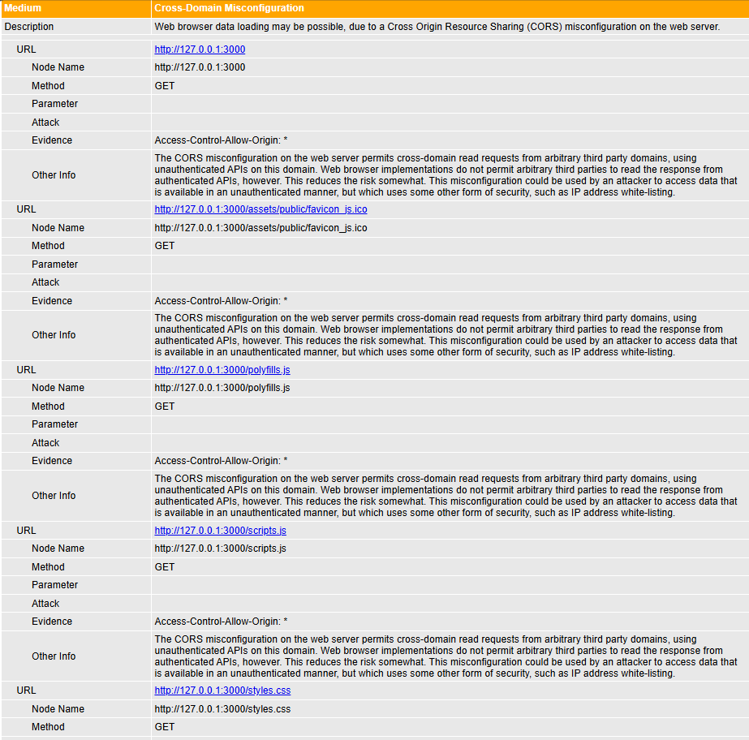
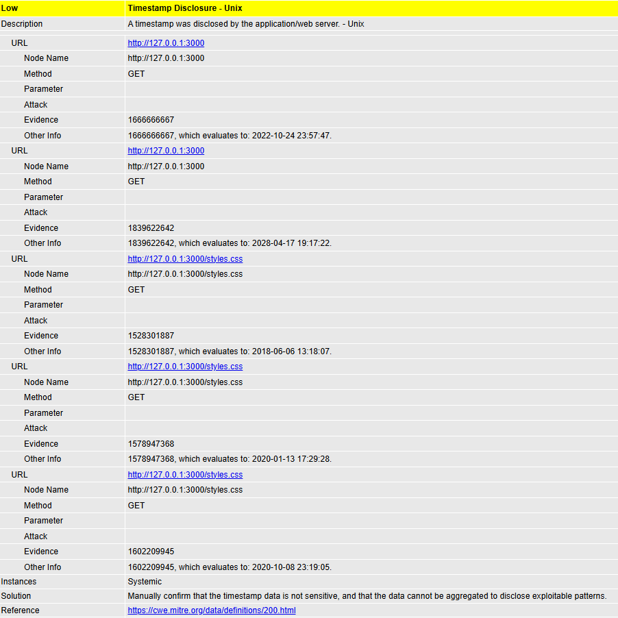

## 25.4 Evidências da execução

A execução da sessão de verificação foi registrada por meio do relatório HTML exportado pelo OWASP ZAP e de capturas de tela dos alertas selecionados.

Os arquivos estão armazenados na pasta `evidencias/etapa-5/` do repositório.

### Relatório completo

O relatório da sessão está disponível em:

[relatorio-zap-juice-shop.html](../../evidencias/etapa-5/relatorio-zap-juice-shop.html)

### Resumo dos alertas

A sessão identificou dois alertas de risco médio, um alerta de risco baixo e três alertas informativos. Os três achados analisados foram escolhidos entre os alertas de risco médio e baixo.

### Evidências dos achados selecionados

**A01 — Content Security Policy (CSP) Header Not Set**

**A02 — Cross-Domain Misconfiguration**

**A03 — Timestamp Disclosure - Unix**

As evidências demonstram que a varredura foi realizada exclusivamente em `http://127.0.0.1:3000`, correspondente ao OWASP Juice Shop executado localmente.
