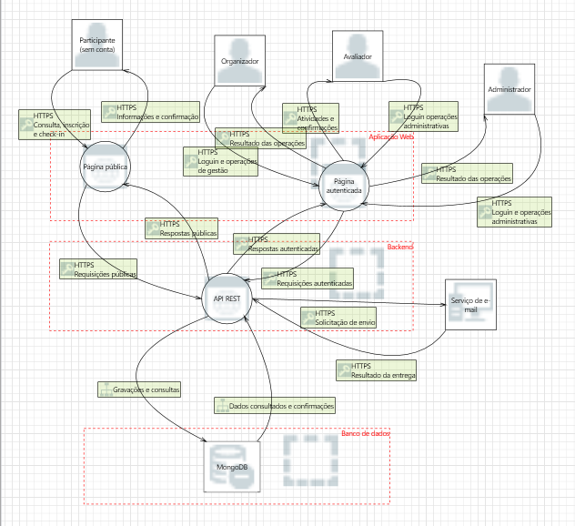

# 4. Modelagem de ameaças com STRIDE

A modelagem de ameaças da plataforma BAITA Eventos foi realizada com o auxílio do Microsoft Threat Modeling Tool e da metodologia STRIDE.

## 4.1 Processo de modelagem

Inicialmente, foi construído um diagrama de fluxo de dados representando os usuários, os componentes da plataforma, os serviços externos, os fluxos de informações e as fronteiras de confiança.

*Figura 1 — Diagrama de fluxo de dados da plataforma BAITA Eventos utilizado na modelagem STRIDE.*

A partir desse diagrama, o Microsoft Threat Modeling Tool gerou 111 ameaças potenciais. Essas ameaças foram utilizadas como ponto de partida para a análise realizada pelo grupo.

Cada ocorrência foi revisada considerando as funcionalidades, os usuários, os ativos e a arquitetura do BAITA Eventos. Foram retiradas ocorrências duplicadas, genéricas ou incompatíveis com a arquitetura. As ameaças mantidas foram reescritas em linguagem natural e contextualizadas para representar situações que poderiam afetar a plataforma.

A parte numérica dos identificadores gerados pelo Microsoft Threat Modeling Tool foi preservada. Neste documento, foi acrescentado o prefixo `T`, de ameaça, para facilitar sua identificação. Identificadores de um único dígito são apresentados com zero à esquerda para manter a padronização visual. Dessa forma, a ameaça `T01` corresponde ao ID `1` da ferramenta.

## 4.2 Componentes considerados

Para manter a consistência da documentação, foram adotados os seguintes nomes:

| Componente | Descrição |
|---|---|
| Participante | Pessoa sem conta que utiliza a página pública para consultar informações, inscrever-se e realizar check-in. |
| Organizador | Usuário autenticado responsável pela configuração e gestão dos eventos aos quais está vinculado. |
| Avaliador | Usuário autenticado responsável pelas avaliações para as quais foi designado. |
| Administrador | Usuário autenticado com permissão para gerenciar usuários, permissões e solicitações administrativas. |
| Página pública | Parte da aplicação web acessível sem autenticação. |
| Área autenticada | Parte da aplicação web utilizada por organizadores, avaliadores e administradores. |
| API REST | Componente responsável pela autenticação, autorização, validação e execução das regras de negócio. |
| MongoDB | Banco de dados utilizado para armazenar as informações da plataforma. |
| Serviço de e-mail | Serviço externo utilizado para enviar convites, confirmações e notificações. |

Os fluxos entre componentes são representados pelo padrão `Origem → Destino`. Por exemplo, `Fluxo API REST → MongoDB` representa os dados enviados pela API REST para gravação no banco.

## 4.3 Critérios de seleção

Uma ameaça foi mantida quando:

- envolvia um usuário, componente ou fluxo existente;
- correspondia a uma funcionalidade da plataforma;
- poderia afetar um ativo relevante;
- apresentava um impacto de segurança identificável;
- era compatível com a arquitetura web do BAITA Eventos;
- não estava suficientemente representada por outra ameaça;
- contribuía para a análise de uma categoria do STRIDE.

Foram consideradas repetidas as ocorrências que descreviam o mesmo problema em sentidos diferentes de um fluxo ou para componentes com o mesmo comportamento de segurança.

Após a revisão, 30 das 111 ameaças geradas foram selecionadas.

| Categoria | Quantidade selecionada |
|---|---:|
| Spoofing | 7 |
| Tampering | 3 |
| Repudiation | 6 |
| Information Disclosure | 2 |
| Denial of Service | 6 |
| Elevation of Privilege | 6 |
| **Total** | **30** |

A prioridade automática não foi utilizada como critério de seleção, pois as 111 ocorrências foram exportadas pela ferramenta com prioridade `High`.

## 4.4 Convenções utilizadas

As ameaças foram reescritas para representar o contexto do BAITA Eventos, evitando a reprodução literal das descrições genéricas da ferramenta.

A redação das ameaças identifica primeiro o possível agente e, em seguida, a ação realizada. Sempre que aplicável, foi utilizado o padrão “Um atacante...” ou “Um usuário...”.

Os impactos apresentam primeiro a principal consequência para a plataforma, utilizando expressões padronizadas, como:

- acesso indevido;
- alteração indevida;
- exposição de dados;
- perda de rastreabilidade;
- indisponibilidade;
- comprometimento da aplicação.

O campo `ID` utiliza o prefixo `T` seguido pelo identificador numérico original do Microsoft Threat Modeling Tool. O prefixo e o zero utilizado em identificadores de um único dígito são apenas convenções visuais deste documento e não alteram a correspondência com a ferramenta.

## 4.5 Ameaças identificadas

As ameaças selecionadas foram agrupadas de acordo com as seis categorias do STRIDE. As descrições foram contextualizadas para os usuários, os componentes, os fluxos e as funcionalidades do BAITA Eventos.

### 4.5.1 Spoofing — falsificação de identidade

| ID | Componente | Ameaça identificada | Possível impacto |
|---|---|---|---|
| T10 | Organizador | Um atacante obtém as credenciais de um organizador e acessa a área autenticada em seu nome. | Alteração indevida de eventos, atividades, inscrições e configurações. |
| T13 | Avaliador | Um atacante utiliza a conta de um avaliador para consultar inscrições ou registrar avaliações. | Exposição de dados e alteração indevida de avaliações. |
| T16 | Administrador | Um atacante se passa por um administrador da plataforma. | Alteração indevida de usuários, permissões e solicitações de associação. |
| T98 | Fluxo API REST → Serviço de e-mail | Um atacante faz um serviço falso se apresentar à API REST como o serviço externo de e-mail legítimo. | Exposição de informações, convites ou tokens enviados ao serviço falso. |
| T112 | Fluxo API REST → MongoDB | Um atacante faz um componente não autorizado se apresentar ao MongoDB como se fosse a API REST legítima. | Acesso e alteração indevida de informações armazenadas. |
| T113 | Fluxo API REST → MongoDB | Um atacante faz um banco falso se apresentar à API REST como o MongoDB legítimo. | Exposição de dados enviados para uma infraestrutura controlada pelo atacante. |
| T121 | Fluxo MongoDB → API REST | Um atacante faz uma fonte falsa se apresentar como o MongoDB e fornecer informações adulteradas à API REST. | Alteração indevida das informações exibidas e dos resultados processados. |

### 4.5.2 Tampering — alteração indevida

| ID | Componente | Ameaça identificada | Possível impacto |
|---|---|---|---|
| T01 | Página pública | Um atacante envia conteúdo malicioso por um formulário, e esse conteúdo é exibido sem tratamento adequado. | Comprometimento da página pública por meio da execução de scripts maliciosos. |
| T11 | Área autenticada | Um atacante insere conteúdo malicioso que é posteriormente exibido na área autenticada sem tratamento adequado. | Comprometimento das sessões de organizadores, avaliadores ou administradores. |
| T114 | MongoDB | Um atacante altera ou corrompe informações armazenadas no banco de dados. | Alteração indevida de inscrições, check-ins, avaliações, resultados ou configurações. |

### 4.5.3 Repudiation — negação de ações

| ID | Componente | Ameaça identificada | Possível impacto |
|---|---|---|---|
| T38 | API REST | Um atacante realiza inscrições ou check-ins sem que sejam mantidos registros suficientes sobre a origem, a data e o resultado da operação. | Perda de rastreabilidade de inscrições e confirmações de presença. |
| T54 | API REST | Um usuário realiza uma operação autenticada sem que sua identidade seja registrada adequadamente. | Perda de rastreabilidade das operações autenticadas. |
| T60 | Organizador | Um organizador altera um evento ou uma atividade e posteriormente nega ter realizado a modificação. | Perda de rastreabilidade das alterações realizadas no evento. |
| T66 | Avaliador | Um avaliador registra ou modifica uma nota e posteriormente nega a autoria da ação. | Perda de rastreabilidade das avaliações e contestação dos resultados. |
| T72 | Administrador | Um administrador realiza uma operação sem que seja mantida uma trilha de auditoria suficiente. | Perda de rastreabilidade das alterações de usuários, permissões ou associações. |
| T115 | MongoDB | Um agente envolvido nega que determinada gravação ou alteração tenha sido realizada no banco de dados. | Perda de rastreabilidade das gravações e alterações de informações. |

### 4.5.4 Information Disclosure — exposição de informações

| ID | Componente | Ameaça identificada | Possível impacto |
|---|---|---|---|
| T116 | Fluxo API REST → MongoDB | Um atacante intercepta informações transmitidas entre a API REST e o MongoDB. | Exposição de dados pessoais, inscrições, avaliações, tokens ou configurações. |
| T123 | API REST | Um usuário explora uma falha de autorização para consultar dados de outro evento ou perfil. | Exposição indevida de dados pessoais, inscrições ou avaliações. |

### 4.5.5 Denial of Service — indisponibilidade

| ID | Componente | Ameaça identificada | Possível impacto |
|---|---|---|---|
| T40 | Fluxo Página pública → API REST | Um atacante envia uma grande quantidade de requisições aos recursos públicos da plataforma. | Indisponibilidade das consultas, inscrições e operações de check-in. |
| T56 | Fluxo Área autenticada → API REST | Um atacante envia requisições abusivas para degradar ou interromper as operações autenticadas. | Indisponibilidade das funcionalidades utilizadas pelos usuários internos. |
| T100 | Fluxo API REST → Serviço de e-mail | Um atacante interrompe ou degrada a comunicação entre a API REST e o serviço externo de e-mail. | Indisponibilidade do envio de convites, confirmações e notificações. |
| T117 | Fluxo API REST → MongoDB | Um atacante envia requisições abusivas para consumir processamento, memória ou conexões disponíveis. | Indisponibilidade ou degradação do desempenho da plataforma. |
| T119 | MongoDB | Um atacante provoca ou explora a indisponibilidade do banco durante operações de leitura ou gravação. | Indisponibilidade do processamento de inscrições, check-ins e avaliações. |
| T124 | API REST | Um atacante provoca ou explora falhas que fazem a API REST parar ou responder lentamente. | Indisponibilidade das principais funcionalidades da plataforma. |

### 4.5.6 Elevation of Privilege — elevação de privilégio

| ID | Componente | Ameaça identificada | Possível impacto |
|---|---|---|---|
| T12 | Operações do organizador | Um usuário executa operações de organizador sem possuir o perfil ou o vínculo necessário com o evento. | Alteração indevida de eventos, atividades, inscrições e configurações. |
| T15 | Operações do avaliador | Um usuário acessa ou altera avaliações de atividades para as quais não foi designado. | Alteração indevida de notas, comentários e resultados. |
| T18 | Operações administrativas | Um organizador ou avaliador acessa uma funcionalidade exclusiva do administrador. | Alteração indevida de usuários, permissões ou associações administrativas. |
| T57 | API REST | Um atacante envia uma entrada maliciosa que permite a execução de código não autorizado na API REST. | Comprometimento da aplicação e acesso indevido às informações armazenadas. |
| T58 | API REST | Um atacante manipula parâmetros para desviar o fluxo de execução das regras de negócio. | Alteração indevida de informações ou execução de operações não autorizadas. |
| T59 | Área autenticada | Um atacante induz o navegador de um usuário autenticado a executar uma operação sem seu consentimento, caso a autenticação utilize cookies enviados automaticamente. | Execução indevida de operações em nome do usuário por meio de CSRF. |

## 4.6 Síntese da análise

A revisão demonstrou que as ameaças mais relevantes estão relacionadas ao comprometimento das contas internas, às falhas de autorização entre perfis, à exposição dos dados das inscrições, à alteração de avaliações e à indisponibilidade durante períodos críticos.

A análise também evidenciou a importância dos registros de auditoria. Sem esses registros, alterações em eventos, avaliações, usuários ou permissões podem não ser atribuídas ao responsável.

As ameaças selecionadas servirão como base para a elaboração dos casos de abuso e para a análise de riscos da Etapa 2. Os IDs apresentados permitirão relacionar essas análises aos arquivos gerados pelo Microsoft Threat Modeling Tool.

## 4.7 Materiais complementares

Além desta análise, estão disponíveis no repositório:

- o modelo editável do Microsoft Threat Modeling Tool;
- a imagem do diagrama de fluxo de dados;
- o CSV original com as 111 ameaças;
- a planilha estruturada com a saída original;
- a planilha com as 30 ameaças selecionadas.

Esses arquivos preservam a saída original da ferramenta e permitem acompanhar o processo de revisão e contextualização realizado pelo grupo.
